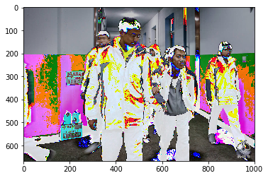
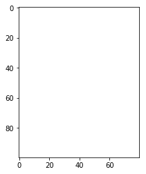
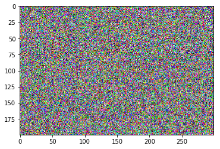
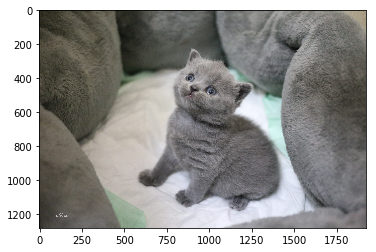
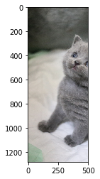

```python
import numpy as np
data = np.zeros(6).reshape(2,3)
data
```


    array([[0., 0., 0.],
           [0., 0., 0.]])


## 这是Apple上的第一个代码
### 不知道效果怎么样
#### 这是正文，也不知道该写点啥了


```python
# import pandas as pd
# sale_data = 'XX.xls'
# data = pd.read_excel(sale_data, index_col='日期')
# data.describe()
```


```python
import matplotlib.pyplot as plt
cat = plt.imread('python/1000.jpeg')
type(cat)
cat.shape
```


    (668, 1000, 3)


```python
cat.reshape(668*1000*3)
```


    array([144, 146, 158, ..., 125, 117, 114], dtype=uint8)


```python
cat2 = cat - 50
plt.imshow(cat2)
plt.show()
```





```python
import numpy as np
n1 = np.array([2,3,4])
n1.shape
```


    (3,)


```python
n2 = np.array([[1,2,3],[2,3,4]])
n2.shape
```


    (2, 3)


```python
cat.shape
```


    (668, 1000, 3)


```python
cat2.shape
```


    (668, 1000, 3)


```python
np.ones(shape=(10,8),dtype=int)
```


    array([[1, 1, 1, 1, 1, 1, 1, 1],
           [1, 1, 1, 1, 1, 1, 1, 1],
           [1, 1, 1, 1, 1, 1, 1, 1],
           [1, 1, 1, 1, 1, 1, 1, 1],
           [1, 1, 1, 1, 1, 1, 1, 1],
           [1, 1, 1, 1, 1, 1, 1, 1],
           [1, 1, 1, 1, 1, 1, 1, 1],
           [1, 1, 1, 1, 1, 1, 1, 1],
           [1, 1, 1, 1, 1, 1, 1, 1],
           [1, 1, 1, 1, 1, 1, 1, 1]])


```python
ones = np.ones(shape=(100,80,3),dtype=float)
plt.imshow(ones)
plt.show()
```





```python
# lin = linear  线性划分
np.linspace(1,100,50)
# 满秩矩阵
n3 = np.eye(5)
n3
```


    array([[1., 0., 0., 0., 0.],
           [0., 1., 0., 0., 0.],
           [0., 0., 1., 0., 0.],
           [0., 0., 0., 1., 0.],
           [0., 0., 0., 0., 1.]])


```python
#随机数
np.random.randint(1,100,size=3)
```


    array([62, 15, 20])


```python
np.random.randn(100)
```


    array([-0.2038032 ,  0.36925153, -1.82690566, -0.24422924, -1.7145561 ,
            0.86735662,  0.12541111,  0.50487869, -0.33924109, -0.6583343 ,
           -0.37274805,  0.79455362, -0.35724344,  0.2546393 ,  0.70687268,
           -0.39765538,  0.68849236,  0.41212159, -0.68608951,  1.25036266,
            1.18607471, -0.48970081, -0.27975877, -0.51331362,  1.91162048,
            0.17925677, -0.64146077, -0.21018357,  0.55442264, -0.19180722,
           -2.34810339,  0.92384647,  0.53521105, -0.73340487,  0.54537028,
            0.33175422,  1.08203772,  0.64186603,  0.92958809, -1.49019251,
           -0.71396476,  0.23384565,  0.1040045 ,  1.19966593, -0.25416457,
            0.60279242,  0.67809898, -0.43001455, -1.40113409, -1.48707435,
            0.52859352, -0.39655878,  0.00686821,  1.66750974, -0.86354021,
           -0.73035244, -1.08424891, -1.14859484,  0.54913627, -0.43502123,
            1.5165151 ,  0.24158905,  1.19843263, -0.25384032, -0.70801206,
            0.2690676 , -1.73221151,  0.1073102 ,  1.55187856, -0.12406239,
           -0.7288454 , -0.27243674, -0.28318745, -1.40894947, -1.14669853,
            0.34599339,  0.00767539,  0.06375574, -0.96980997,  0.18941525,
            0.93059341, -0.03864899,  0.17625638,  0.13522562,  0.61073963,
            0.68053733, -0.48175819, -1.72306305,  0.01615583, -0.86984654,
           -0.67692439,  1.21127884,  1.17098537, -0.26439   ,  1.27357574,
           -0.0567352 ,  0.71552076,  0.7483914 , -0.76194989, -1.5331887 ])


```python
np.random.normal(loc = 175,scale = 5,size = 100)
```


    array([174.34702628, 173.4775895 , 176.33263375, 173.86703275,
           169.34950573, 174.83170097, 176.05740977, 177.6200697 ,
           184.74892536, 176.57534807, 166.29445551, 175.02368847,
           179.41511533, 178.09933875, 170.99524271, 180.9078884 ,
           173.1403399 , 186.28672455, 169.27704785, 171.09187543,
           174.60922485, 164.38002571, 171.38712407, 171.35234107,
           168.44484611, 180.70200061, 178.07378536, 176.828191  ,
           172.6248376 , 174.90276399, 178.50104762, 175.64919784,
           181.62729636, 168.00696342, 174.85786355, 185.69777304,
           174.67756491, 178.43712089, 167.79738524, 177.25798107,
           173.84031268, 173.18808335, 165.53374664, 169.46833498,
           172.01508444, 180.61134373, 173.10593486, 163.62845307,
           181.45775912, 177.68090159, 175.49819961, 183.30285433,
           176.82658696, 180.8769926 , 166.46412951, 181.49364261,
           173.89436253, 177.95899342, 169.07670289, 176.49014692,
           164.6458295 , 171.16081369, 182.4987506 , 166.46535633,
           178.29691777, 172.54158805, 182.07994924, 177.17950113,
           173.83007224, 170.54841481, 175.44114877, 168.36383205,
           169.88330546, 178.4097369 , 179.78853625, 177.67671017,
           177.65758801, 173.33109498, 168.41040502, 174.76303478,
           179.52868161, 173.78593797, 178.25861294, 173.53119748,
           178.476987  , 177.05614539, 180.34018037, 180.38381475,
           172.11151342, 179.93152827, 179.2767635 , 178.80564664,
           185.00407546, 180.0419358 , 171.14379056, 190.6170589 ,
           169.37309838, 167.96034879, 166.40237898, 172.49064596])


```python
# 随机生成一张图片
r = np.random.random(size = (200,300,3))
plt.imshow(r)
plt.show()
```





```python
n2 = np.random.randint(150,size=10)
n2[0:5]
```


    array([ 27,  92,  79, 142,  48])


```python
n3 = np.random.randint(60,size=24)
n4 = n3.reshape(2,3,4)
```


    array([[[57, 53, 37, 12],
            [59,  9, 48, 48],
            [34, 17, 44, 50]],
    
           [[22, 50, 10, 10],
            [ 6, 58,  0, 59],
            [23, 20,  8, 35]]])


```python
n3 = np.arange(24)
n4 = n3.reshape(2,3,4)
print(n4)
n4[0:1,0:2,2:3]
```

    [[[ 0  1  2  3]
      [ 4  5  6  7]
      [ 8  9 10 11]]
    
     [[12 13 14 15]
      [16 17 18 19]
      [20 21 22 23]]]


    array([[[2],
            [6]]])


```python
n3 = np.arange(0,10)
```


```python
# ::取数据  -1 倒序
n3[::2]
n3[::-2]
```


    array([9, 7, 5, 3, 1])


```python
n1 = np.random.randint(0,10,size = (5,5))
n1
```


    array([[1, 4, 7, 9, 0],
           [0, 4, 5, 1, 3],
           [7, 5, 4, 0, 4],
           [9, 9, 8, 7, 8],
           [9, 7, 3, 8, 1]])


```python
# 级联操作
np.concatenate((n1,n1))
```


    array([[1, 4, 7, 9, 0],
           [0, 4, 5, 1, 3],
           [7, 5, 4, 0, 4],
           [9, 9, 8, 7, 8],
           [9, 7, 3, 8, 1],
           [1, 4, 7, 9, 0],
           [0, 4, 5, 1, 3],
           [7, 5, 4, 0, 4],
           [9, 9, 8, 7, 8],
           [9, 7, 3, 8, 1]])


```python
np.concatenate((n1,n1),axis=1)
```


    array([[1, 4, 7, 9, 0, 1, 4, 7, 9, 0],
           [0, 4, 5, 1, 3, 0, 4, 5, 1, 3],
           [7, 5, 4, 0, 4, 7, 5, 4, 0, 4],
           [9, 9, 8, 7, 8, 9, 9, 8, 7, 8],
           [9, 7, 3, 8, 1, 9, 7, 3, 8, 1]])


```python
cat = plt.imread("python/cat.jpeg")
plt.imshow(cat)
plt.show()
```





```python
cats = np.concatenate((cat,cat))
plt.imshow(cats)
plt.show()
```


```python
n2 = np.random.randint(0,150,size=10)
n2
```


    array([144,  58,  94,  20, 125,  36, 127,  76,  65,  78])


```python
#vertical 垂直
n3 = np.vstack(n2)
n3
```


    array([[144],
           [ 58],
           [ 94],
           [ 20],
           [125],
           [ 36],
           [127],
           [ 76],
           [ 65],
           [ 78]])


```python
n4 = np.array([[2,3,4,5],[3,4,5,6]])
np.hstack(n4)
```


    array([2, 3, 4, 5, 3, 4, 5, 6])


```python
np.hstack(np.hstack(cat))
```


    array([ 38,  39,  31, ..., 104, 104, 106], dtype=uint8)


```python
cat.shape
```


    (1280, 1920, 3)


```python
n5 = np.random.randint(0,150,size=(5,7))
np.split(n5,(1,3))
```


    [array([[ 82,  68, 118,  68, 117,  13,  12]]),
     array([[123, 102,  97,  62, 119, 121,  43],
            [ 39,  51,  92,  22, 132,   9,  36]]),
     array([[111,  96,  41,  98, 100,  58,  54],
            [ 24, 148,  62,  68,  97,  68, 117]])]


```python
#  axis=0 行 axis=1 列
plt.imshow(np.split(cat,(500,1000),axis=1)[1])
plt.show()
# 同 vsplit 垂直方向，切分行
# hsplit 水平方向 且分列
```





```python
n = np.random.randint(0,150,size=(4,4,4))
n
```


    array([[[105, 117, 112,  34],
            [ 20,  53,   5,  55],
            [144, 103,  40,  68],
            [ 10,  52, 147,  10]],
    
           [[137, 128,  97,  29],
            [ 49,  59, 122,   5],
            [  5,  35, 127,  37],
            [ 55,  99,  60,  95]],
    
           [[111,  52,   8,  11],
            [142,  72,  62, 141],
            [ 65,  33,  79,  40],
            [ 89,  73, 105,  13]],
    
           [[ 59, 142, 117,  33],
            [ 66,  12,  42,   2],
            [132, 116,  28,  15],
            [ 90,  99,  57, 115]]])


```python
# axis=0 最外层比
# axis=1 每一层 行与行比
# axis=2 一行比
n.max(axis=2)
```


    array([[117,  55, 144, 147],
           [137, 122, 127,  99],
           [111, 142,  79, 105],
           [142,  66, 132, 115]])


```python
n.mean(axis=0)
```


    array([[103.  , 109.75,  83.5 ,  26.75],
           [ 69.25,  49.  ,  57.75,  50.75],
           [ 86.5 ,  71.75,  68.5 ,  40.  ],
           [ 61.  ,  80.75,  92.25,  58.25]])


```python

```
